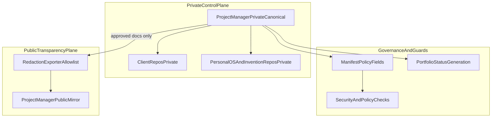

# PM Public/Private Git Architecture

Version: `v1.0`
Owner: `Melissa Stock`
System steward: `Project Manager`
Last updated: `2026-04-21`

---

## 1) Decision

Use a **hybrid architecture**:

- Keep `Project Manager` as the **private canonical control plane**.
- Publish a **redacted public mirror** that only includes approved non-sensitive portfolio artifacts.
- Keep all client repos and all Personal OS / invention repositories private.

This supports public accountability for process quality without exposing client evidence or protected IP.

---

## 2) Priority Order (Today)

1. `P0` Security posture verification across PM + managed repos.
2. `P0` Data and IP boundary enforcement in manifest + intake.
3. `P1` Public redaction pipeline design and controls.
4. `P1` Git operating model standardization (repo-per-client, branch semantics).
5. `P2` Automation hardening for ongoing compliance checks.

---

## 3) Architecture

---

## 4) Data and IP Policy Model

Each managed repository must define:

- `visibility_tier`: `public`, `private-internal`, `private-client`, `private-archive`
- `data_class`: `public-open`, `internal-ops`, `legal-financial-restricted`, `regulated-sensitive`, `family-sensitive`, `research-sensitive`, `archive-sensitive`, `ip-restricted`
- `ip_class`: `internal-standard`, `personal-os-protected`, `client-invention-protected`
- `public_sync_allowed`: `true|false`

Policy rules:

1. If `visibility_tier` starts with `private`, default `public_sync_allowed` must be `false`.
2. Any `ip_class` of `personal-os-protected` or `client-invention-protected` must not be mirrored publicly.
3. `data_class` of legal/financial/family/regulated types must never appear in public mirror exports.

---

## 5) Git Operating Model

### Repository strategy

- **Repo-per-client/project** is the source-of-truth model.
- PM tracks repos via manifest metadata and gitlinks where needed.
- No client evidence should be committed directly in parent PM.

### Branch strategy

- Branches represent lifecycle only: `main`, `feature/*`, `release/*`, `hotfix/*`.
- Do not use long-lived branch names as a client-isolation mechanism.
- Client isolation is at repository boundary, not branch boundary.

### Backup and archive strategy

- Backup/archive clones must not share a production `origin` with canonical repos.
- Use separate remote targets (`-backup` repo, fork, or cold mirror).
- Force-push operations are disallowed on canonical production remotes except approved incident recovery.

---

## 6) Public Mirror Design

Public mirror should be generated by an explicit allowlist export process:

1. Source from private canonical PM.
2. Export only approved files (architecture/process docs, non-sensitive status summaries, templates).
3. Block files that include restricted paths, raw evidence directories, or sensitive class tags.
4. Validate export before publish:
   - regex scan for secrets and high-risk identifiers
   - manifest policy gate (`public_sync_allowed=true` only)
   - manual review checkpoint for policy-sensitive changes

Recommended implementation options:

- Option A: dedicated `public` branch in same repo from generated export commit.
- Option B: dedicated `Project-Manager-Public` repo populated by export script.

Option B is preferred for clean separation and easier access control.

---

## 7) Required Security Baseline

- Branch protection or rulesets on all default branches for canonical repos.
- Secret scanning and push protection enabled where available.
- Least-privilege tokens and periodic rotation schedule.
- Required pull-request review on policy and manifest changes.
- Periodic remote-topology audit (detect duplicate origins and backup collisions).

---

## 8) Immediate Implementation Scope

- Update manifest schema and repository entries with visibility/data/IP fields.
- Update intake template so every new project is classified at intake.
- Update status generator to surface visibility and data class in `STATUS.md`.
- Create security audit artifact and remediation checklist.

## 9) Registry Migration Note

- Shared metadata canonical source is `os-registry` (private).
- `Project Manager/config/repos.json` remains operational as a derived mirror until migration completes.
- Dual-write updates across registry and mirror are disallowed; update registry first, then sync/export.
- Product repos should consume registry data via API contract or synced snapshots.
